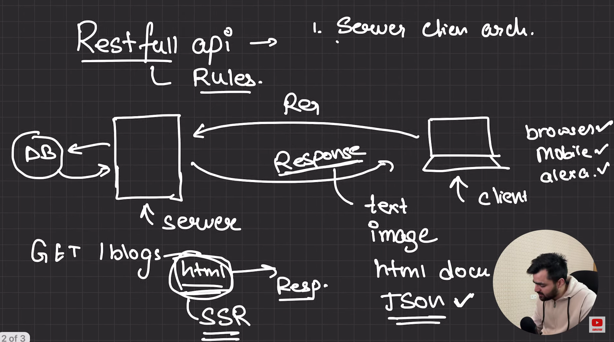
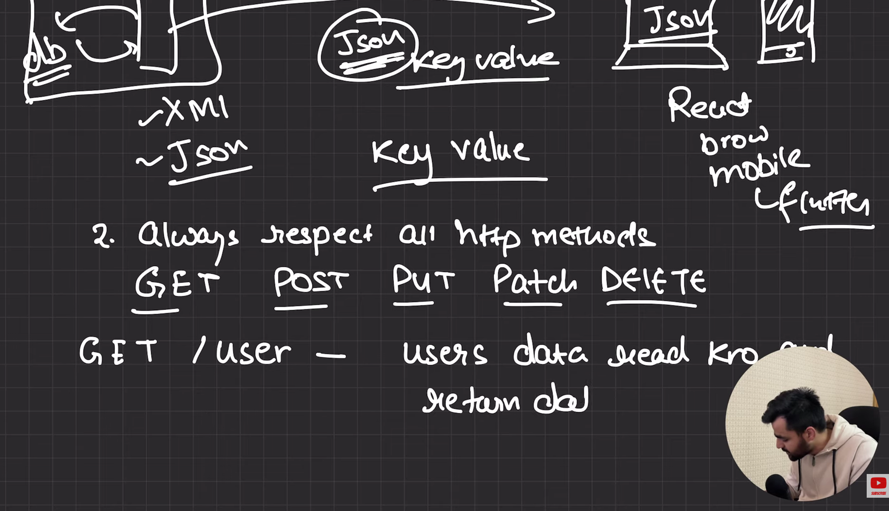
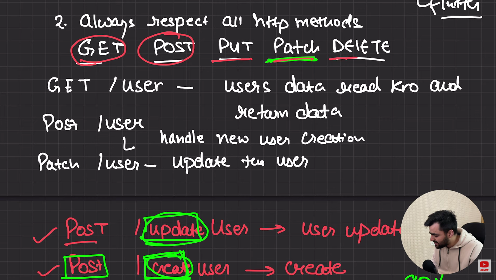
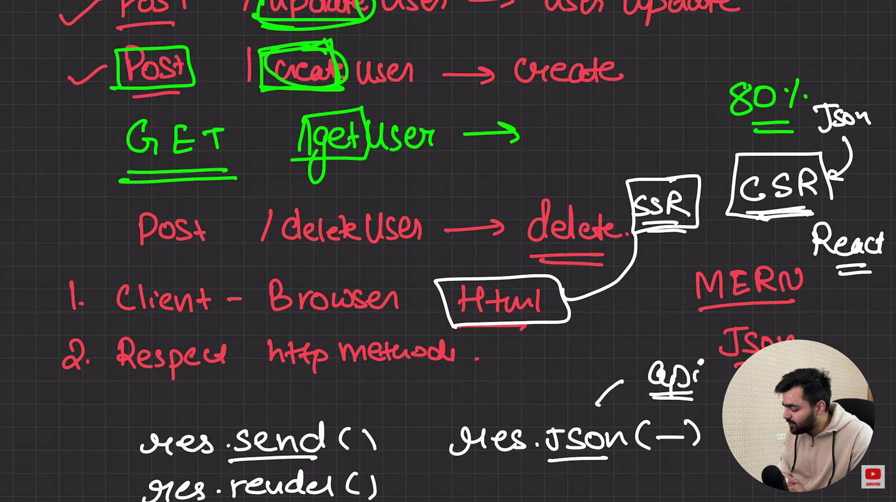

# Restfull API Rules

1. Works on server client architecture.

:- It means the server and client should be independent e.g client send get request to server for blogs now server well get data from db and send in the form what they want called server side rendering the data can be html text img etc but client can be different what if the client is alexa aur Iot at that time its not work

:-so what it means that the server take blogs from db and then send data to client in raw formate this means in json and now the client or frontend part decide who we render that data 

 

2. Always Respect All Http methods.
    Get , Post , Put , Delete

    Get /user - user data read kro and return kro

    Post /user - handle new user creation

    Pathch /user - Update the user

    what it means we give a http methods get post put etc we have to respect them if we want not delet use than we use DELET but some person do POST/deletuser it is not a good pratice so we always respect the http methoh we alway use the request for which they is made 
    e.g Get/user is Good pratice but GET/getuser it is not good pratice it make confusion

 

Always Respect All Http methods.
