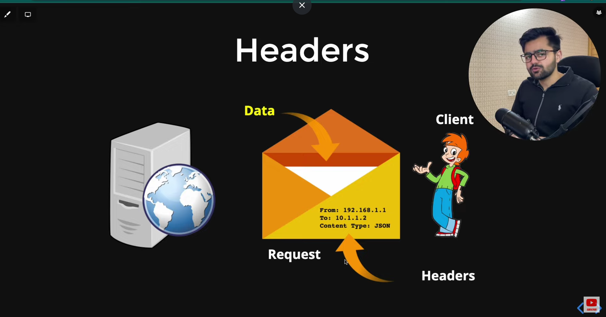
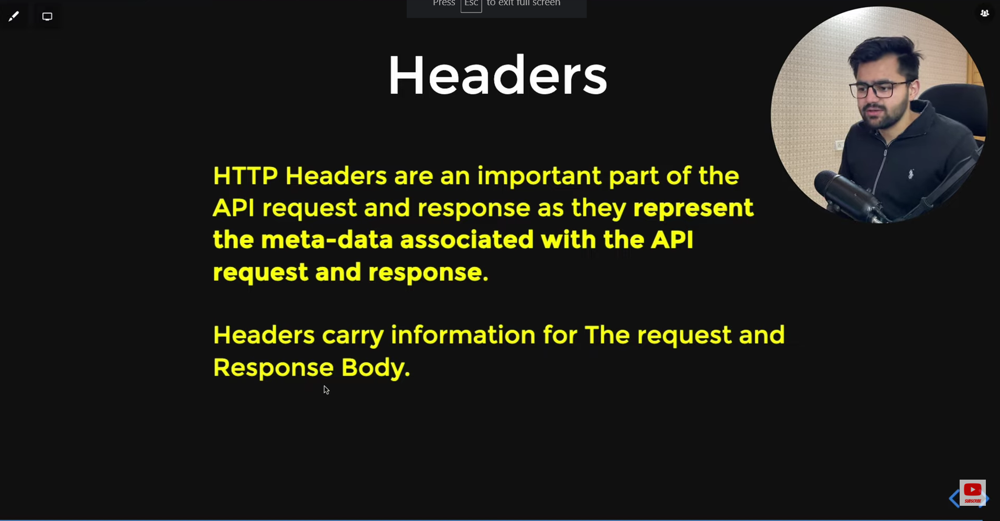

# What are http Headers in API ?

For e.g there is two friend A and B a Send a letter to B and B send reply of that letter in Letter There in envolepe and under envelope there is data and envelope has a information "From","TO","Weight" That is a header of that conversion,SO if we not have that information we dont know ehere to send a letter

similar A is a client B is a Server and envelope in a request under request we have actual data the information on request are headers,"From":Where the request is come ,"TO":Where to send,"Weight":How much data size

An HTTP header is a feild of an HTTP request or response that passes additional contex and metadata about the request or respose.

